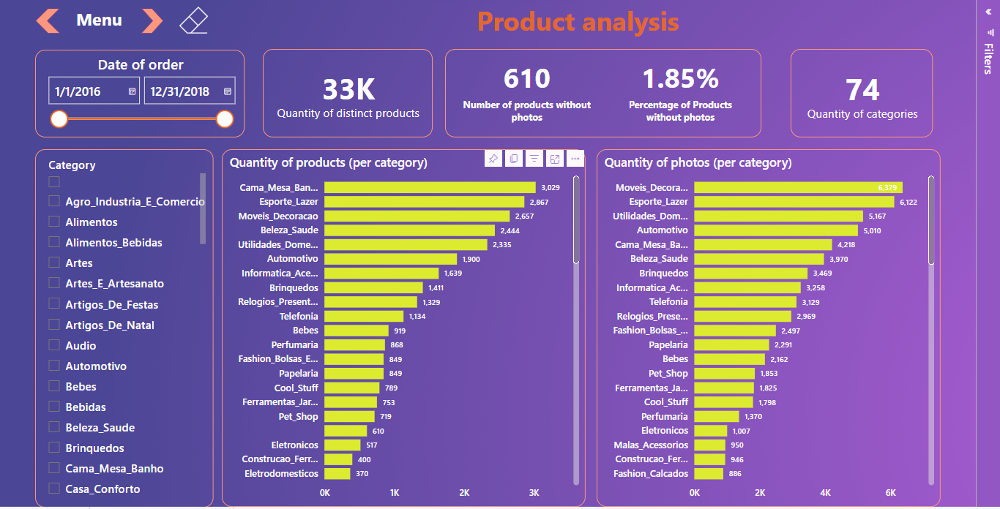
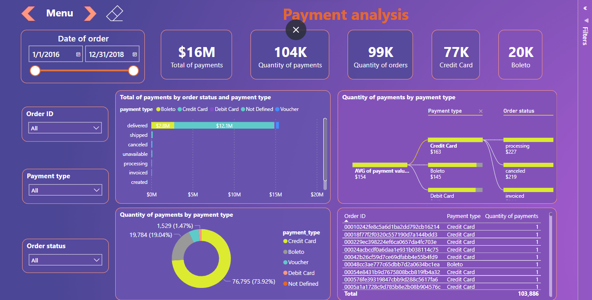
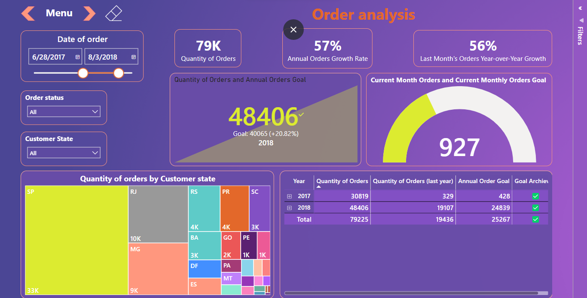
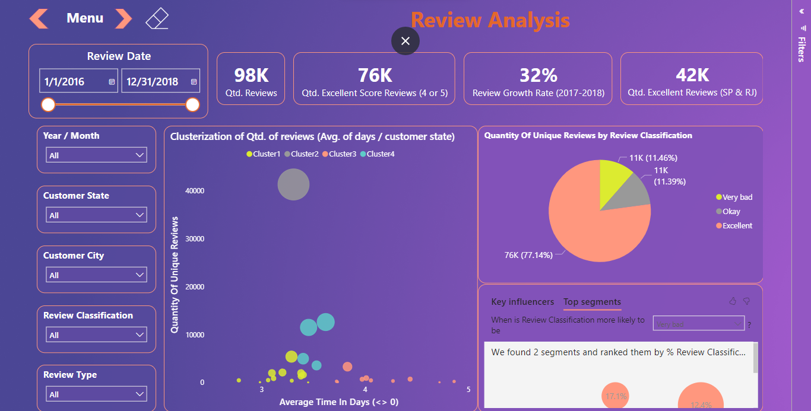
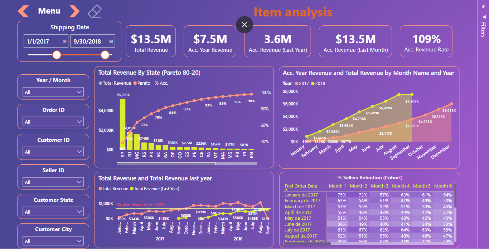

# **Olist sales Power BI Report**

## 1. **Business Problem**

Olist is the largest department store in Brazilian marketplaces. Olist connects small businesses from all over Brazil to channels without hassle and with a single contract. Those merchants are able to sell their products through the Olist Store and ship them directly to the customers using Olist logistics partners.

They want to get more knowledge and more actionable insights about their order data. A POWER BI report with some dashboards was created to analyze this dataset.

## 2. **Dataset**

The dataset has information of 100k orders from 2016 to 2018 made at multiple marketplaces in Brazil. Its features allows viewing an order from multiple dimensions: from order status, price, payment and freight performance to customer location, product attributes and finally reviews written by customers. We also released a geolocation dataset that relates Brazilian zip codes to lat/lng coordinates.

The data is divided into multiple datasets for better understanding and organization. Please refer to the following data schema when working with it:

## 3. **Solution Strategy**

DATA IMPORT:

Gathering the dataset and importing it into Power BI for data transformation.

DATA TRANSFORMATION:

Using Power Query to clean the data, removing nulls and duplicates, fine-tuning data types, creating new columns, making Date table and managing table relationships. 

DATA IMPLEMENTATION:

Creating different DAX functions to make calculated measures and columns, refining the data for deeper insights.

REPORTS CREATION:

Defining a theme for report based on companies color and color pallete for plots,tables and cards. Making plots, cards, table and slicers for each dashboard.

## 4. **Dashboards**

**Menu Dashboard**

**Product Analysis**

**Payment Analysis**

**Order Analysis**

**Review Analysis**

**Item Analysis**

